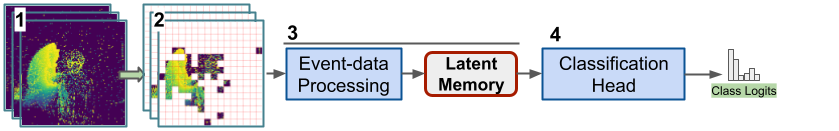
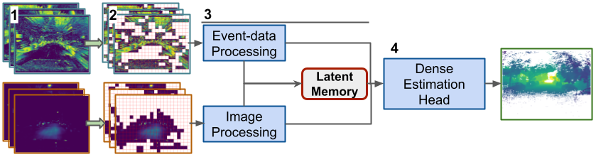

# EventTransformer+

[[Paper](https://arxiv.org/abs/2211.12222)]

This repository contains the official code from __Event Transformer+. A multi-purpose solution for efficient event data processing__, a work based on _Event Transformer. A sparse-aware solution for efficient event data processing_.

Event Transformer+ (EvT+) takes advantage of the event-data sparsity to increase its efficiency. EvT+ uses a new sparse patch-based event-data representation and a compact transformer architecture that naturally processes it. EvT+ shows high performance on event-stream estimation, allowing its use with multi-modal data and requiring minimal computation resources, being able to work with minimal latency both in GPU and CPU. 

<p align="center"></p>
<p align="center"><em>EvT+ for event-stream classification</em></p>

<p align="center"></p>
<p align="center"><em>EvT+ for dense estimation from event-stream + additional modality</em></p>

### Citation:

```
@article{sabater2022event,
  title={Event Transformer+. A multi-purpose solution for efficient event data processing},
  author={Sabater, Alberto and Montesano, Luis and Murillo, Ana C},
  journal={arXiv preprint arXiv:2211.12222},
  year={2022}
}

@InProceedings{Sabater_2022_CVPR,
    author    = {Sabater, Alberto and Montesano, Luis and Murillo, Ana C.},
    title     = {Event Transformer. A sparse-aware solution for efficient event data processing},
    booktitle = {Proceedings of the IEEE/CVF Conference on Computer Vision and Pattern Recognition (CVPR) Workshops},
    month     = {June},
    year      = {2022},
}
```

### REPOSITORY REQUIREMENTS

The present work has been developed and tested with Python 3.8, PyTorch 1.9.1, and Ubuntu 18.04
To reproduce our results we suggest creating a Python environment as follows.

```
conda create --name evtp python=3.8 -y
conda activate evtp
pip install -r requirements.txt
```


### PRETRAINED MODELS

Trained models hyperparameters and checkpoints are located in `./trained_models/`.


### DATA DOWNLOAD AND PRE-PROCESSING

The datasets involved in the present work must be downloaded from their source and stored under a `./datasets` path:
 - DVS128: https://research.ibm.com/interactive/dvsgesture/
 - SL-Animals-DVS: http://www2.imse-cnm.csic.es/neuromorphs/index.php/SL-ANIMALS-DVS-Database
 - MVSEC: https://daniilidis-group.github.io/mvsec/
 - EVIMO2: https://better-flow.github.io/evimo/download_evimo_2.html

In order to have a faster training process we pre-process the source data by building intermediate frame representations, that will be later loaded by our data generator.
This transformation can be performed with the files located under `./dataset_scripts`.


### EvT EVALUATION

The evaluation of our pretrained models can be performed with the files: `./classification/evaluate_clf_model.py`, `./dense_estimation/evaluate_dense_model.py`, and `./dense_estimation/evaluate_dense_model.py`.
At the beginning of the file, you can select the pretrained model to evaluate, the device where to evaluate it (CPU or GPU), and the kind of evaluation to perform (_performance_, _efficiency_, or model _complexity_).


### EvT TRAINING

The training of a new model can be performed with the files: `./classification/trainer.py`, `./dense_estimation/trainer.py`, and `./dense_estimation/trainer.py`.
At the beginning of the file, you can select the pretraining model from where to copy its training hyper-parameters.
Note that, since the involved datasets do not contain many training samples and there is data augmentation involved in the training, the final results might not be exactly equal to the ones reported in the article. If so, please perform several training executions.


